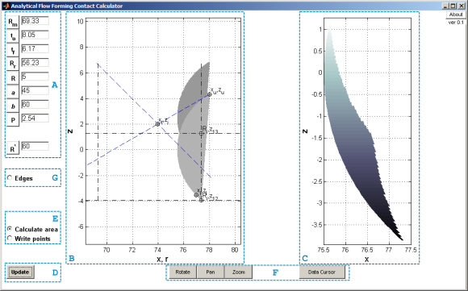
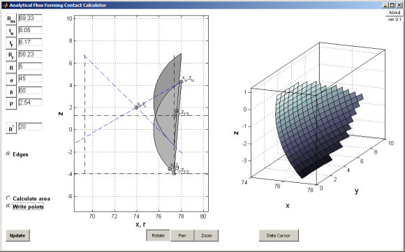
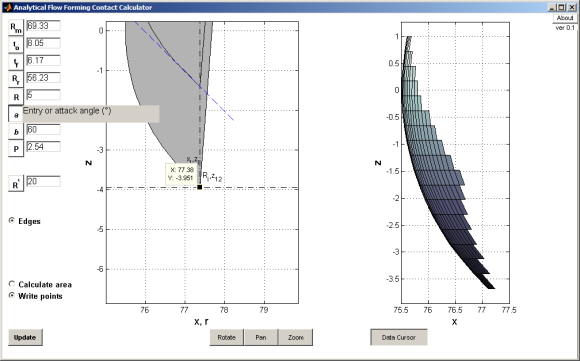

Introduction
============

An application has been developed
in MATLAB to assist in
visualizing the contact patch of a single roller during a flow forming
operation with the means of a GUI. The
details of how this contact is calculated appears in the paper
["Analytical solution of the tooling/workpiece contact interface
shape during a flow forming
operation"](http://dx.doi.org/10.1016/j.jmatprotec.2010.07.011)
published in the Journal of Materials Processing Technology, hereafter
referred to as ‘the paper’. A preprint of this paper is available
[here](http://arxiv.org/abs/1206.2547).


Overview
========

The main window is accessed by running `AFFC.m`. Note that the companion subfunctions `plot2Dsol.m`, `plot3Dsol.m`, `ToolContactArea.m` and `ToolContactPointCloudWrite.m` are required on the MATLAB path at run time. [Fig. 1](#fig1) shows the interface highlighting the main
features. On the far left of the GUI, section `A` shows the region where the geometrical
variables describing the contact solution may be updated. The default
values are those which were used to experimentally validate the contact
solution, as described in the paper indicated above. Region
`B` and `C` are output plots generated by pressing the ‘Update’ button indicated in
`D`. The radio buttons in region
`E` activate area calculation functionality and the ability to write the solution’s 3D point cloud to an external `.csv` file in the local directory. Buttons in region
`F` activate navigation and data exploration
modes. Finally, the radio button indicated in `G` permits showing the edges on graphical
elements displayed in `B` and `C`. These regions/functions are described
subsequently.

<span></span>

*<a name="fig1"></a> Fig. 1: AFFC interface with main features highlighted.*

Functionality
=============

Input
-----

There are nine locations for the input of the solution variables and
process geometry ([Fig. 1](#fig1)-`A`), and these are
described in the following table. Descriptions of each variable appear
over each input field upon pressing the associated button/label. Note
that aside from the angular dimensions, the solution is not dependent on
units, as long as they are consistent. The tooling arrangement employed
to validate the solution via a physical model as described in the
publication appear as default values, input in millimetres. Note that the attack and planishing angles may only approach 90 and 0 degrees.

Variable|  Description
---                     |---
R  | Mandrel radius
t<sub>o</sub>   |Original workpiece thickness
t<sub>f</sub>   |Final workpiece thickness
R<sub>r</sub>   |Roller radius excluding nose radius
R    |Roller nose radius
a    |Attack angle in degrees (<90&deg;)
b  |Exit or planishing angle in degrees (>0&deg;)
P  |Roller pitch
R<sup>*</sup>  |Solution resolution


Output
------

There are three possible sources of output of the solution. The first is
the default graphical output and the contact condition as documented in
the paper, which is echoed to the command line. Secondly, the results of
area calculations may be displayed as output echoed to the command line.
Finally, raw output is available in the form of a 3D point cloud which
is written by the application to a file specified by the user.

### Graphical output and navigation

The default is the 2D and 3D graphical output shown in [Fig. 1](#fig1)-`B` and `C` respectively, which update according to
changes in variables. The 2D figure corresponds to Fig. 4 and 5 in the
paper, while the 3D plot corresponds to Fig. 6 in the paper. These plots
may be perused using the manipulation tools located in region
`F`. An example of the ‘Rotate’ function is
shown in [Fig. 2](#fig2). Pan and zoom are self-explanatory. To
reset to the original view, double left-click the respective axis, or
right-click and choose the appropriate option from the menu that
appears.

<span></span>

*<a name="fig2"></a> Fig. 2: AFFC interface with 'Edges' on, showing how the 3D plot may be rotated.*

The coordinates of any displayed point may also be interrogated in both
the 2D and 3D plots by activating the ‘Data Cursor’. This is shown with
the 2D plot in [Fig. 3](#fig3), where the Data Cursor has been
used to display the values of R<sub>i</sub>,\,z<sub>12</sub> in the paper.

<span></span>

*<a name="fig3"></a> Fig. 3: AFFC interface showing the use of the 'Data Cursor'. The variable description for a has also been selected.*

### Contact area calculation output

In order to generate the results of the overall contact area as well as
the area projected on the major planes, the 'Calculate area' radio
button in region [Fig. 1](#fig1)-`E`
must be selected. The contact area in square units is then displayed on the console, just below the contact condition (please see paper for contact condition meaning):
```
Condition AI...

Calculated areas . . . 
Overall     |X plane    |Y plane    |Z plane
40.502342   |36.835296  |2.449122   |13.756200
```

Here, the overall contact area is displayed, with the projection of the contact area on the planes orthogonal to x, y and z axes, respectively.

### Point cloud output

By selecting the 'Write points' radio button in region [Fig. 1](#fig1)-`E`, the coordinates
corresponding to each of the vertices plotted in the 3D display are
written to a file specified by the user. This is accomplished by another GUI window launching from the current working directory, which will launch upon pressing 'Update'.
The format of the data is x coordinate, y coordinate, z coordinate:
```
75.664,0,1.27
75.642,0,1.1815
75.642,0.19215,1.1815
75.643,0.38429,1.1815
75.644,0.57644,1.1815
75.646,0.76858,1.1815
```

Extensions
=======

The subfuntions `plot2Dsol.m` and `plot3Dsol.m` can be run in standalone form from MATLAB. Note that output from `plot2Dsol.m` is required for `plot3Dsol.m`, and new figure handles need to be created in between to show discrete output:
```
%vars=[Rm to tf Rr R a b P]
vars=[69.33 8.05 6.17 56.23 5 45 60 2.54];
Rstar=60;
figure;
zlimits=plot2Dsol(vars,0); %2nd argument is for showing edges
figure;
[X Y Z]=plot3Dsol([vars Rstar],zlimits,0); % Rstar is appended to vars, 2nd argument is for showing edges
```

